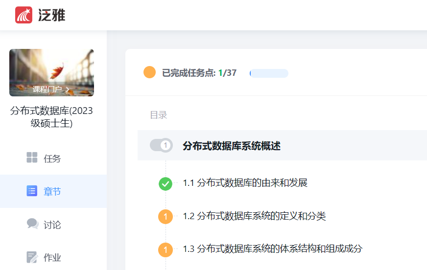

# 学习通下崽器

## 简介

用于下载超星学习通课程的课件，包括视频和 ppt ， ppt 为 pdf 格式

## 环境要求

* Python 3.7 或更高版本
* Python selenium
* Edge 或 Chrome 浏览器

## 使用方式

* 打开 main.ipynb
* 设置 Code 2 中的常量值，包括下载模式和等待时间
* 执行 Code 1-5
* 在启动的浏览器中，输入学习通的账号密码并登录
* 进入你所需要下载课件的课程
* 点击左侧菜单栏中的章节，如下图所示

* 执行 Code 6-9 ，这将保存课程页面到 page_source.html ，并建立文件 course_urls.txt ，或者向该文件追加 url
* —————————————————————————————
* 注意，这一步将使浏览器不断打开标签页、加载数据、关闭标签页
* 除非你清楚自己在做什么，否则不要中断该代码格的执行！
* 执行 Code 10 ，这将建立文件 XHR_urls.txt 或者向该文件追加 url
* —————————————————————————————
* 执行 Code 11，这将建立下面三个文件，或向它们追加数据
* resource_urls.txt 、resource_names.txt 、resource_types.txt
* —————————————————————————————
* 注意，这一步将下载资源，下载内容依赖于你在 Code 2 中的设置
* 通常，下载 pdf 不会花费太多时间，但下载视频需要较长的时间和较大的存储空间
* 执行 Code 12
* —————————————————————————————
* 提示：下载的课件是 pdf 文件，但实际扩展名可能是 ppt 或 pptx ，需要手动修改扩展名
* 提示2：可以使用 PowerToys 批量修改文件名

## 注意

由于采用的是文本追加模式，如果要将代码应用于多个课程，需要在每个课程下载完毕后删除产生的6个临时文件

## 代码解析

见注释

## 未来可能的更新

* 每个课程的资源和临时文件放置于独立的文件夹
* 提供更多设置选项
* 支持部分下载
