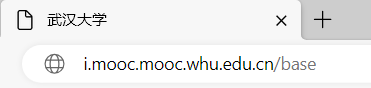

# 学习通下崽器

## 简介

用于下载超星学习通课程的课件，包括视频和 ppt ，ppt 为 pdf 格式

## 环境要求

* Python 3.7 或更高版本
* Python selenium
* Edge 或 Chrome 浏览器

## 使用方式

* 打开 main.ipynb
* ———————————————————————————
* 填写 Code 2 中的配置选项，包括下载模式、等待时间、资源目录、passport、Referer
* 对于 passport、Referer 这两项，如果你使用超星学习通的登录验证，可以使用代码中的默认值
* 如果你使用学校的登录验证，需要自行填写这两项，否则可能会无法登录或下载资源
* ———————————————————————————
* 执行 Code 1-5
* 在启动的浏览器中，输入学习通的账号密码并登录
* 注意，代码仅支持新版学习通界面，如果你仍然使用旧版界面，需要切换至新版
* 以 `武汉大学` 为例，如下图，这是通过学习通登录的 url

  
* 你需要将其更改为下图以进入新版界面

  
* ———————————————————————————
* 现在，通过新版界面，进入你需要下载课件的课程主页面
* 点击左侧菜单栏中的章节，如下图所示

* ———————————————————————————
* 执行 Code 6-9 ，这将保存课程页面到 page_source.html ，并建立文件 course_urls.txt ，或者向该文件追加 url
* ———————————————————————————
* 注意，这一步将使浏览器不断打开标签页、加载数据、关闭标签页
* 正常情况下，你将看到浏览器打开学生学习页面，如果弹出登录界面，通常只需要登录一次
* 除非你清楚自己在做什么，否则不要中断该代码格的执行！
* 执行 Code 10 ，这将建立文件 XHR_urls.txt 或者向该文件追加 url
* ———————————————————————————
* 执行 Code 11，这将建立下面三个文件，或向它们追加数据
* resource_urls.txt 、resource_names.txt 、resource_types.txt
* ———————————————————————————
* 注意，这一步将下载资源，下载内容依赖于你在 Code 2 中的设置
* 通常，下载 pdf 不会花费太多时间，但下载视频需要较长的时间和较大的存储空间
* 执行 Code 12
* ———————————————————————————
* 提示：下载的课件是 pdf 文件，但实际扩展名可能是 ppt 或 pptx ，需要手动修改扩展名
* 提示2：可以使用 PowerToys 批量修改文件名

## 注意

* 由于采用的是文本追加模式，在中断代码的执行后，如不清理临时文件，可能会引起资源的重复下载
* 如果在加载资源或下载过程中发生了错误或其它意外情况，可以尝试后面的调试用单元格

## 代码解析

见注释

## 更新说明

### Version 0.2

#### 2023/10/28

#### 增加对校内登录验证的支持

武汉大学已经列入代码内注释

#### 增加资源目录配置选项

下载不同课程的资源时，设置该选项以将下载的资源放在独立的目录中

### Version 0.1

#### 2023/10/28

## 未来可能的更新

* 提供更多设置选项
* 支持部分下载
* 支持旧版学习通界面
